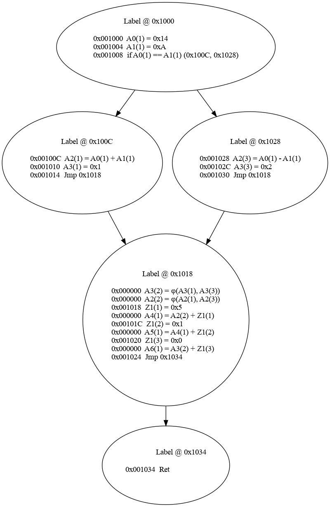
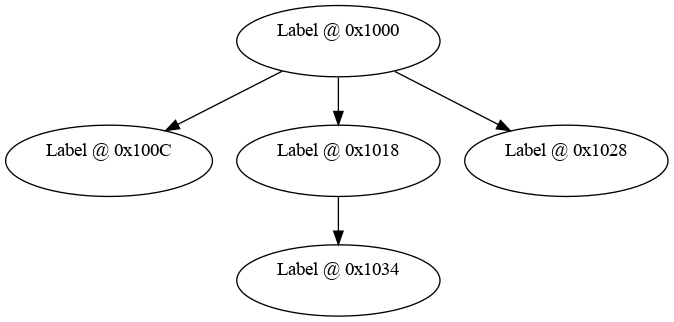

# sfuzz
Start date: Dec, 2021

JIT compiler / Fuzzer in development
Requires rustup nightly channel to compile

#### Overview

This project focuses on high performance RISC-V to x86\_64 binary translations for the purpose of
fuzzing. The fuzzer now runs successfully against simple targets, the below task list represents
what I believe is necessary for the fuzzer to become a viable choice for general purpose targets.
<br>

**Task List**
- [X] Virtualized files for in-memory fuzzing
- [X] Byte level permission checks + hooked/safe allocators (asan)
- [X] 2 Different modes of block-level coverage (Hitcounts & No Hitcounts)
- [X] Persistent mode to fuzz in small loops around target functions
- [ ] Update mutators to include more options and to work based off coverage feedback
- [ ] Crash deduping
- [ ] Fix the remaining few JIT-bugs
- [ ] Implement riscv-atomics so the JIT can deal with libc binaries as opposed to newlib
- [ ] 2 Different modes of edge-level coverage (Hitcounts & No Hitcounts)
- [ ] Crash exploration mode
- [ ] CMP deconstruction to get past magic values and checksums
- [ ] Proper benchmarking
- [ ] Input-to-coverage mapping to focus mutators on useful bytes
- [ ] Replace assembler to increase compile time's

The objective is to highlight the benefits of using an emulated environment for
fuzzing. Many previous fuzzers based on emulation exist,, but they almost exclusively use the qemu
emulation engine for the underlying emulation. While this engine does have a fairly mature
just-in-time compiler, it is not designed for fuzzing. During fuzzing, we intend to run the same
process thousands of times per second. This makes room for specialized optimizations that qemu does
not make strong use of such as reusing the same memory space for each process run and only
resetting a limited amount of memory via dirty bit mechanics.<br><br>

Sfuzz starts by allocating a memory space for the main emulator and creating a JIT backing. Next
a binary is loaded from disk and parsed to map the relevant regions into the emulators address
space. Finally a stack is setup for the emulator, and function hooks at malloc & free are
registered so calls to these functions make use the custom heap functions of the mmu. Now
multiple copies of the emulator are created, and each one is started in a separate thread. These
threads will run until the fuzzer is shut off. The main thread is the dedicated thread to
calculate and provide statistics.

At this point each emulator starts doing it's own thing. The only shared information remaining
is the JIT backing containing compiled x86\_64 machine code and statistics that are sent to
the main
thread in batches. The emulator can now start running code. If a function has already been
compiled, the emulator jumps straight into the JIT buffer and starts executing instructions. If it
has not yet been compiled, the emulator thread that first runs into the code invokes the code
generation phase. This phase locks the JIT backing mutex until the code is compiled, thus stopping
all other threads.

The code generation procedure lifts all RISCV instructions into an intermediate
representation that is means to be architecture agnostic, thus allowing the fuzzer to be extended
with other architectures by implementing a new frontend. This intermediate representation is then
passed on to the jit backend which takes care of compiling the code into X86\_64 machine code,
copies it over into the jit backing buffer and populates the riscv -> X86 lookup table with the
newly compiled addressed.

Since this is a JIT compiler that only compiled one function at a time, we need to have the ability
to exit the JIT during execution. Some possible reasons are that a function is hit that has not yet
been compiled, various errors such as out of bound reads/writes, syscalls or hooked functions.
During execution in the JIT, rsp is never modified, so the JIT can be entered and exited with code
shown below.

First the JIT address is determined via either the lookup table or by first compiling the function.
This address is then passed to the unsafe block that uses inlined assembly to invoke the JIT. The
memory region allocated for the emulator, alongside memory mapped registers and the JIT lookup table
are loaded into registers so the JIT can make use of them. In the JIT itself, it makes use of these
passed in pointers to access memory or lookup addresses in the lookup table. If it has to leave the
JIT for one of the previously mentioned reasons, it sets an exit code, the address it wants to
reenter on and returns back to the emulator.


```rs
// Determine if the given address has already been compiled. If so, just return the JIT address, if
// not, lift the code into the intermediate representation and compile it.
let jit_addr = match (*self.jit).lookup(pc) {
    Option::None => {
        // IR instructions + labels at start of each control block
        let irgraph = self.lift_func(pc).unwrap();

        // Compile the previously lifted function
        self.jit.compile(&irgraph, &self.hooks).unwrap()
    },
    Some(addr) => addr
};

// Enter the JIT
unsafe {
    let func = *(&jit_addr as *const usize as *const fn());

    asm!(r#"
        call {call_dest}
    "#,
    call_dest = in(reg) func,
    out("rax") exit_code,
    out("rcx") reentry_pc,
    in("r13") self.memory.memory.as_ptr() as u64,
    in("r14") self.state.regs.as_ptr() as u64,
    in("r15") self.jit.lookup_arr.read().unwrap().as_ptr() as u64,
    );
}

// Exit the JIT
mov rax, <exit_code>
mov rcx, <addr>
ret
```

During execution, once the vm is left, the emulator determines the next step based on the exit code.
If the reason was a syscall or a hooked function, a callback function is invoked to handle this
event. If new code needs to be compiled, the above process just repeats. The current codes are:

```
1: Code found that has not yet been compiled -> compile it and reenter JIT
2: Syscall encountered -> Check syscall number and invoke according function before reentering JIT
    Currently implemented syscalls: close, write, fstat, exit, brk
3: A hooked function has been encountered -> Invoke call back and reenter JIT
    Currently implemented hooks: malloc, free
4: Debug print -> Print out current state of all registers and reenter JIT
```

#### Riscv toolchain to test the binary

This sets up a toolchain to compile riscv binaries that can be loaded/used by this project.
```
Riscv compiler/tooling:
    sudo apt-get install autoconf automake autotools-dev curl python3 libmpc-dev libmpfr-dev \
    libgmp-dev gawk build-essential bison flex texinfo gperf libtool patchutils bc zlib1g-dev \
    libexpat-dev
    git clone https://github.com/riscv-collab/riscv-gnu-toolchain && cd riscv-gnu-toolchain
    ./configure --prefix=/opt/riscv --with-arch=rv64i
    sudo make
Debugger:
    gdb-multiarch
```

#### Memory Management

The memory management unit is responsible for simulating a memory environment. Each spawned
emulator gets its mmu. The main components of this mmu are 2 continuous blocks of memory (one
for the actual memory and one for permissions), and an api that exposes various operations on
his memory such as allocations, frees, reads and writes. The permissions region is necessary
because this emulator makes use of byte-level permission checks. These are done by maintaining
an entire memory space used purely for permissions.

The mmu exposes a custom alloc/free implementation that in combination with the byte level memory
permissions detects most relevant heap bugs (double free, uaf, heap buffer overflow).

`1. Byte level permission checks`

On most architectures, permissions are handled at the hardware level. This means that whenever an
instruction tries to access memory, with permissions not matching the access pattern, an abort is
generated which is then handled at the software level. Generally these permissions are handled at
the page table level so each page of memory has its own permission bits. With guard pages placed
around critical locations such as kernel memory, this protects the operating system from crucial
many bugs, and prevents memory accesses that are completely off of their target. When it comes to
exploitation however, a small 8 byte out of bounds access can oftentimes already be enough to
compromise the security of an application.  

A tool commonly used while fuzzing is address sanitizer (also called asan). When a binary is 
compiled using asan, it is instrumented at compile time with extra checks that make sure that every 
memory access has the correct access permissions. This tool however has a few very relevant issues. 
For one it requires access to the binaries source code to recompile it with proper instrumentation. 
This makes it only useful to open source projects, which especially when fuzzing embedded systems,
is often not available. Secondly, asan has a very non-significant performance overhead. According to
a study conducted by google in 2012 (AddressSanitizer: A Fast Address Sanity Checker), it resulted
in a 73% slowdown, which is quite a bit, especially when operating a fuzzer which is entirely
dependant on its performance. This slowdown however was worth it due to the power of byte level
permission checks and led to 300 new bugs being discovered in the Chrome browser at the time.

In this case since the binary is being run in a custom JIT compiler, both of these drawbacks can be 
almost entirely mitigated. Not having source code available is not an issue at all anymore since all 
of the code is being generated at runtime anyways. As for the performance aspects, EXECUTE
permissions are almost entirely free since they are checked once when a function is first compiled,
and then assumed to be true for the rest of program execution. This would need some changes when
dealing with JIT compilers that frequently change their executable memory mappings, but for 99% of
use cases it should suffice. As for load and store instructions (that require the READ and WRITE
permissions), the checks consist of 5 assembly instructions (1 memory load, 1 conditional jmp and 3
arithmetic instructions). While this results in some additional overhead when performing frequent
memory accesses, it is nowhere near as expensive as address sanitizer.

These permission bits mean that every out of bounds memory access (even if it is just a
single byte) instantly results in a notification to the fuzzer which can then modify its corpus to
focus on this bug and attempt to increase the out of bounds bug. This permission model also applies
to library functions such as malloc & free. These are hooked at compile time to instead call custom
malloc/free implementations that support this byte level memory model. These hooked functions also
include additional checks to completely destruct free'd memory so common heap bugs such as use
after free's or double free's are instantly reported as well instead of leading to undefined
behavior.

`2. Dirty-bit memory resets`
In the current implementation each new address space is 64mb large. This means that on each new fuzz
case, this entire space needs to be reset to its initial state. Doing a massive 64mb memcpy() on
each new fuzz case is very impractical and leads to completely unacceptable performance. Here we can
borrow a concept that is common in the operating systems world: dirty bits. In operating systems,
these are mainted at the page table level similar to the permissions. This bit is set whenever a
write to memory occurs. This means that when copying memory between different cache levels, or just
clearing memory, the page table can be traversed, and only pages with the dirty bit set need to have
work done on them.

The same principal applies to this fuzzer. When a fuzzer is run, only a very small percentage of
this 64mb address space is actually overwritten. This means that by maintaining a dirty bit list,
we can selectively chose which pages are reset while leaving most of the memory intact. The memory
space in this case is not maintained in a page table so some of the implementation details differ,
but the principal remains.

The implementation in this project was heavily influenced by Brandon Falk's prior research into
obtaining extremely fast memory resets. He tested multiple different approaches over the years, but
eventually settled on one similar to this since walking the page tables in the jit-compiled assembly
code to set a dirty bit was unnecessarily expensive. Instead 2 vector data structures are
maitained. Whenever memory is dirtied, the address is pushed to an initially empty array that
contains a listing of all dirtied memory regions. Additionally a dirty bitmap is maintained that is
used to verify that only 1 address from each page is pushed to this array to avoid duplicates.
Populating this vector during execution is very simple and only requires 6 additional instructions
during store operations. While resetting, the fuzzer can then just iterate through the previously 
populator vector and free the address ranges that were pushed to the vector.

#### Code Generation

This emulator makes use of a custom just-in-time compiler for all of its execution. The code
generation is a multi-step process that will hopefully lead to a 20-50x performance increase over
pure emulation once simple optimizations are applied.

Once execution is started, each individual emulator thread has the ability to compile new code.
Whenever the emulator runs into a function that we have not yet compiled it invokes a mutex on the
JIT code backend and attempts to compile the entire function into the JIT backend before resuming
execution. While this mutex does have performance costs due to stopping all other threads,
it allows
us to have one memory region of code that all threads can make use off, thus only having to compile
each function once which ultimately leads to both memory and performance improvements. Once the
compilation is completed, the mutex is unlocked and the address of the newly generated code is
returned to the calling emulator which can then resume execution. At this point all other threads
can also access this newly compiled code via the translation table.<br><br>

`1. Lift the function to the intermediate representation`

The first step of actual code generation is to lift the entire function into an intermediate
representation. The size of the function is determined during the initialization phase when first
loading the target. This is done by parsing the elf metadata and setting up a hashmap mapping
function start addresses to their sizes. <br><br>

This process basically just iterates through all original instructions and creates an IR
instruction based on the original instruction using large switch statement. The below example
imitates how the intermediate representation may look like for a very minimal function that
pretty much just performs a branch based on a comparison in the first block.
```
Label @ 0x1000
0x001000  A0 = 0x14
0x001004  A1 = 0xA
0x001008  if A0 == A1 (0x100C, 0x1028)

Label @ 0x100C
0x00100C  A2 = A0 + A1
0x001010  A3 = 0x1
0x001014  Jmp 0x1018

Label @ 0x1018
0x001018  Z1 = 0x5
0x000000  A4 = A2 + Z1
0x00101C  Z1 = 0x1
0x000000  A5 = A4 + Z1
0x001020  Z1 = 0x0
0x000000  A6 = A3 + Z1
0x001024  Jmp 0x1034

Label @ 0x1028
0x001028  A2 = A0 - A1
0x00102C  A3 = 0x2
0x001030  Jmp 0x1018

Label @ 0x1034
0x001034  Ret
```
<p style="text-align:center;"<i>F1</i></p>

There are a couple of things to note here that may not be obvious. The addresses in the left
column represent the addresses from the original RISCV executable. Since this is a JIT compiler,
these addresses need to be maintained to dynamically translate jumps to functions that we
may not yet have compiled. Some of the addresses above however list 0x0. This is because the
intermediate representation sometimes needs more instructions to represent an original RISCV
instruction and thus only the first IR instruction corresponding to a RISCV instruction gets
an address. Also note how the register names still represent the original RISCV registers
(apart from Z1/Z2 which are temporary registers used by the IR). This is important to correctly map
special registers such as the Zero register or distinguish between callee-saved/caller-saves
registers later.
<br><br>

At this point I attempted a couple of different approaches before settling on the current code
generation procedure. My first approach was to first transform the above IR code into single static
assignment form. This allows for stronger optimizations and is a very populat choice for modern
compilers. Next I used a linear scan register allocator to assign registers to the code and compile
the final code.

This approach led to multiple issues that led to me eventually abandoning it in favor of the current
implementation. Some of the reasons are listed below.

1. **Debugging** - Since this is meant to be a fuzzer, being able to properly debug crashes, or at
   least print out register states is important. After doing register allocation, determining which
   X86 register is allocated for each RISCV register at runtime to print out useful information is
   very difficult.

2. **Extendability** - When it comes to register allocation, a lot of the backend features (eg.
   A0-A7 for arguments, or syscall number in A7) are architecture dependent. This makes it a lot
   harder to write the backend in a way that can be extended with new architectures by just adding a
   front end.

3. **Performance** - In theory the ssa/regalloc approach can lead to better final code. In this case
   however, since its a binary translator, a lot of registers such as function arguments or stack
   pointers had to be hardcoded to x86 registers since we don't have information such as number of
   arguments when translating binary -> binary. This in addition with the meta-data required by the
   JIT (pointer to memory, permissions, JIT lookup table and register spill-stack) led to most X86
   registers being in use, leaving only 4 X86 registers available for the actual register allocation
   in my approach. This could obviously be greatly improved upon, but this would require a lot more
   time to achieve comparable results.


4. **Complexity** - This approach added a lot of extra complexity to the project which caused major
   issues for project with a relatively short timeframe.

The implementation details for this approach are listed in `Appendix A`, and the code for this
approach can be viewed at commit `7d129ab847d171b66901f4c936dd2ad5c5a1b79a` on the github
repository.

`2. Compiling to x86 machine code`

This phase pretty much just loops through all the previously lifted IR instructions and compiles
them to X86 code. Whenever a syscall or a hooked function is encountered, appropriate instructions
are generated to leave the JIT and handle the procedure. Currently all registers are still memory
mapped, however in the future I plan on hardcoding the most popular riscv registers to X86 registers
as demonstrated in the rv8 paper. The 10 most used registers make up 80% of all riscv register
usages, so this should lead to a great performance increase.

In the current state a simple add instruction would compile to the following. This is still far from
optimal, but the previously mentioned improvement should greatly improve this for common registers.

`r3 = r1 + r2`
```asm
mov rbx, [r14 + r1_offset]
mov rcx, [r14 + r2_offset]
add rbx, rcx
mov [r14 + r3_offset], rbx
```
<br>  

#### Fuzzing

`1. Coverage Tracking`

This fuzzer currently implements 2 different coverage tracking methods. Standard block level
coverage, and block level coverage with hit-counters (tracking how often each block is hit).

Standard block-level coverage without hit-counters converges to 0 performance costs. It initially
has some costs while the fuzzer finds a lot of new coverage since this data needs to be shared
between threads. As fuzzers get deeper into programs however, new coverage events become much rarer,
resulting in this cost being eliminated. Additionally, since we only need to track each block hit
once, the coverage tracking events in the JIT are overwritten with nop's once triggered so they are
basically free as well. These 2 points result in the minimal cost of block-level coverage.

Hit-counter block-coverage in comparison results in a pretty heavy 30-35% performance decrease. This
may be worth it for some cases if the fuzzer can make good use of this information, but as Fioraldi 
et al demonstrated, it can sometimes also harm the fuzzer [10].

The performance hit occurs because the coverage-map is shared between threads, so whenever covarage 
is supposed to be updated, the lock needs to be grabbed, thus slowing down execution. Unlike the
variant without hit-count, these need to be done on every block hit, and not just when a previously
unencountered block is hit, which means that it never has the ability to become cheap. This is 
partially mitigated by buffering the coverage data locally, and just moving on with execution if 
the lock is not currently available instead of waiting for it to free up, but the slowdown remains
noticable.

Once proper backend functions are in place to make use of the coverage information I plan to setup
more comparisons between the coverage-tracking modes, and to implement edge-level coverage. For now
this will suffice though.

`2. Persistent-mode/Snapshot Fuzzing`

This is mostly a performance optimization, but since it is very specific to fuzzing I figured this
category probably suits it best. The basic idea behind persistent fuzzing is that the standard
`fork() + execve()` routine used for fuzzing is slow. 

One initial improvement afl uses is the forkserver optimization, where new processes are cloned
from a copy-on-write master that is kept in the original state. This reduces a lot of the overhead,
but still requires the expensive fork() syscall. A better alternative is to instrument the api with
a custom-written, single-process loop, therefore removing all of the 'execve()/fork()' overhead. AFL
mostly automates this, but still requires the user to write a small harness to designate where this
loop should be positioned.

In the case of sfuzz, since the fuzzer is running in an emulator, this becomes almost trivial. We
can specify a specific address as the snapshot starting-point, run the JIT up to that point, and
take a snapshot of the entire register/memory state. All future fuzz-cases can now use this snapshot
as their starting location instead of having to restart the process from the very beginning. This
can be used to avoid a lot of setup that is disconnected from our fuzzing input and thus greatly
speed up the fuzzing process. This becomes especially useful when dealing with larger targets, for
which we can take a snapshot right before the interesting function, set an exit-point right
afterwards, and then fuzz this function in a very tight/fast loop.

In the small test2.c target, placing a snapshot right after the open() call to skip the initial
setup/file opening, already led to a 30-50% speedup depending on the number of active threads.

<br>

#### Performance Measurements

`1. Initial single threaded JIT performance`

This initial test just compares the fuzzers performance when used on a simple hello world binary.
This is after having implemented dirty bit memory resets and byte level memory checks, the latter of
which adds some performance overhead. In this case I compare the JIT to the below runner that pretty
much just spawns the hello world process using a fork/exec combination similar to how most fuzzers
operate. The JIT achieved 400,000 cases per second which is what I used for the loop size of the
below runner. The C-code, compiled with -O3, needed slightly over 10 seconds to finish, making it
about 10x slower than the JIT in its current state.

```c
int main() {
    char *args[2];
    args[0] = "./hello";
    args[1] = NULL;

    for (int i = 0; i < 400000; i++) {
        if (fork() == 0) {
            execv(args[0], args);
        }
    }
}
```

The C implementation is pretty much as simple as it gets, the JIT however still has a lot of 
potential for optimizations that will further grow this gap. Some of this will come from simple code
optimizations while generating JIT code, others from adding improvements that shorten the code that
has to be run such as snapshot based fuzzing. Another major performance gap will come from
multi-threading. While the C-code above can certainly be multithreaded, it will eventually run into
major locking issues when executing the `fork()` and `execv()` syscalls alongside all of the
syscalls occuring in the actual fuzzer target. All of these have to go into the kernel, and with
enough threads, a lot of time will be wasted in kernel locks. In comparison, the JIT emulates all
syscalls in userland which avoids this cost entirely thus scaling linearly with cores as the
`fork()` implementation starts falling off.

#### Apendix A

`2. Generate single-static-assignment form for the IR`

The next step is to lift the previously generated code into single static assignment form. In this
form each variable is assigned exactly once. This is where the second field of each register comes
in. It is basically a counter for each register used to "create" a new register each time the
register is redefined. This creates some problems if a join point after a branch needs to make use
of a register that differs depending on which branch was taken (eg. in branch 1, `A1(1) = 5` is
executed while in branch 2 `A1(2) = 10` is executed). In this case the succeeding block does not
know on which version of A1 to operate on. Continuing with the above example, the phi function at
the beginning of the join block would look like this: `A1(3) = Phi(A1(1), A1(2))`. The computer
obviously does not have such as instruction, or ssa-form register usage so it needs to eventually
be deconstructed, nevertheless, this ssa representation is very frequently used in compilers
because it provides many advantages when attempting to run optimization passes on the code.

The below graph showcases how this form would look like for the above program. Note how the second
field of each register is now filled to make sure each register is only defined once, and that the
final block in the function now has phi-functions at its beginning for each register that it may be
required for.<br><br>

<p style="text-align:center;"></p>
<p style="text-align:center;"<i>F2</i></p>

In this project ssa form is generated using the techniques proposed in
[Efficiently Computing Static Single Assignment Form and the Control Dependence
Graph](https://www.cs.utexas.edu/~pingali/CS380C/2010/papers/ssaCytron.pdf) by Cytron et al.

This algorithm makes use of dominance frontiers to compute a semipruned ssa representation that has
fewer phi-functions than more naive implementations that may just place phi-functions in
succeeding blocks for every register that survives block boundaries.

In my implementation, the steps to generate this ssa form are divided up into 4 main phases.

* Generate dominator tree

    In this phase, given a block b in the control flow graph, the set of blocks that strictly
    dominate b are given by (Dom(b)-b) where Dom(b) determines all blocks that must be traversed
    starting at the root of the cfg to get to block b. In this set the block that is closest
    to b is b's immediate dominator which is what we care to extract in this phase. This means
    that each cfg block exists in this form and that if a is the immediate dominator of b,
    an edge exists from a to b.

    The corresponding dominator tree for the above program is shown below. The first block
    dominates
    the 2 branching blocks as expected, but unlike in the cfg representation, here an edge exists
    from the first block to the join block because it is the earliest block that strictly dominates
    it.

<p style="text-align:center;"></p>
<p style="text-align:center;"<i>F3</i></p>

* Find the dominance frontier

    The dominance frontier is used to determine which registers require phi-functions for a given
    block. It starts by identifying all join points j in the graph since these are the only blocks
    that may potentially require phi-functions. Next it loops through all of the cfg-predecessors
    of each block j until iDom(j) is found. During this traversal, block j is added to the
    dominance frontier set of each block encountered in this process with the exception of iDom(j).

    This leads to the following dominance frontier for the above program which tells us that
    block 1
    and 2 may need phi functions to be placed in block 2 (block 1 & 2 represent the 2 branches from
    the original CFG as indicated by the labels).
    ```
    Label @ 0x1000 : {}
    Label @ 0x100c : {2}
    Label @ 0x1018 : {}
    Label @ 0x1028 : {2}
    Label @ 0x1034 : {}
    ```
<p style="text-align:center;"<i>F4</i></p>

* Insert phi functions into the graph

    Now that we know where we want to place phi functions, they need to actually be placed for
    registers that require them. Since we have the dominance frontiers we can determine this fairly
    well without accidentally placing many unnecessary phi-functions. For every definition x in
     block b, a phi-function needs to be inserted at every node in the dominance frontier of
    b. Since
    the insertion of a phi-function alters the instruction state, it may force the insertion of
    additional phi-functions. This process needs to restart after every phi-function insertion.

    This results in 2 phi-functions being insterted at the start of block 2 as showcased in the
    F2.

* Rename all registers to their appropriate ssa form

    In this phase the ssa form is completed by finally renaming all registers to their ssa-form
    name. Each register R with multiple definitions will thus be renamed R(1), R(2), ... R(n). This
    is done by maintaining a count of the highest-count definition of a register that is
    incremented whenever a new version of the register is defined alongside a stack that has
    the most recently defined version of the register on top of it.

    The algorithm used here walks through the dominator tree and for each block it starts by
    renaming all defined phi-functions definitions. Next it walks through each block in the
    program and rewrites the operands and declarations using the currently active ssa name for
    each register. For declarations, a newly generated ssa name must be created by incrementing its
    count variable and pushing it onto the registers stack. Finally the parameters of the phi
    functions of blocks succeeding the current block are renamed.

    Next it starts recursively calling the rename procecure on all children of the current
    block in the dominator tree. After this recursive call completes, all newly defined ssa
    registers are popped from each registers stack, thus resetting the register states back to
    the state prior to this blocks renaming procedure.

In the current state of the compiler, ssa representation does not yet serve much of a purpose
(although it can lead to better register allocation) since no optimizations have been written. This
form does however allow for powerful optimizations to be added in the future.<br><br>

`3. Potential Optimizations`

Modern compiler backends employ many different optimizations to produce the best code possible. In
this case, due to limited time I will stick to very simple optimizations that are fairly
straightforward to implement while providing decent performance benefits such as eliminating all
instructions that attempt to write to the Zero register (basically a nop), or some basic constant
propagation to eliminate all temporary instructions that my IR added.<br><br>

`4. Register Allocation`

The goal of this phase is to replace the previously set ssa instruction operands with standard
X86\_64 registers. The main difficulty of this process is to correctly determine efficient register
allocation strategies that result in the least amount of registers being spilled to memory. This
phase is still very early in development, and I am not entirely sure how I want to implement
it yet.

* Instruction Numbering

The first step is to number the instructions. This assigns a unique id to each instruction. The main
thing to consider here is that instructions need to be ordered in order of execution. This means
that every instruction A that is executed before instruction B needs to have a lower id. This can be
accomplished using the previously generated dominator tree's.

* Register Live Intervals

The goal of this phase is to determine how long each register is alive. For each used register it
computed an interval from the point that the register is first defined to its last usage according
to the previously marked id numbers during the instruction numbering phase.

* Linear Scan Register Allocation

This algorithm is pretty much the simplest way to do register allocation across block boundaries.
Nevertheless it is the most popularly used register allocation algorithm in JIT compilers since it
results in low compile time which is an important metric for JIT compilers. Additionally it only
produces slightly worse code than much slower algorithms such as graph coloring approaches.

The pseudo-code for this register allocation approach is listed below. We loop through all
previously determined register liveness intervals and allocate an X86 register as long as there are
free registers are available. If there is no free register available, the last used register is
spilled to memory to obtain a free register.

```rs
for (reg, interval) in live_intervals { // in order of increasing starting point
    // Start by expiring old intervals by removing all no longer in use registers from the active
    // mapping and adding it to the free registers instead.
    expire_old_intervals();

    if free_regs.is_empty() {
    // Need to spill register to memory if there are no more free registers available
        // Spill the register with the farthest use
        spill_reg = active.pop();

        // Use the now free'd register for the current register
        mapping.insert(reg, spill_reg);

        // Insert new range to active range
        active.insert(spill_reg, inter);
    } else {
    // Free register available, so just add it to the mapping
        preg = free_regs.pop();
        active.insert(preg, inter);
        mapping.insert(reg, preg);
    }
    return mapping;
}
```

#### References

* Emulation based fuzzing - Brandon Falk
* Cranelift [https://cfallin.org/blog/] - Chris Fallin
* Rv8: a high performance RISC-V to x86 binary translator - Michael Clark & Bruce Hoult
* Generating Low-Overhead Dynamic Binary Translators - Mathias Payer & Thomas R. Gross
* Efficiently Computing Static Single Assignment Form and the Control Dependence Graph - Cytron et al
* Engineerining a compiler Keith D. Cooper & Londa Torczon
* Computing Liveness Sets for SSA-Form Programs - Brandner et al
* Linear Scan Register Allocation on SSA Form - Christian Wimmer & Michael Franz
* http://web.cs.ucla.edu/~palsberg/course/cs132/linearscan.pdf
* Basic-Block Graphs: Living Dinosaurs? - Jens Knoop et al
* RISCV User ISA specification
* AddressSanitizer: A Fast Address Sanity Checker
    https://static.googleusercontent.com/media/research.google.com/en//pubs/archive/37752.pdf

[10]  https://www.s3.eurecom.fr/docs/fuzzing22_fioraldi_report.pdf
