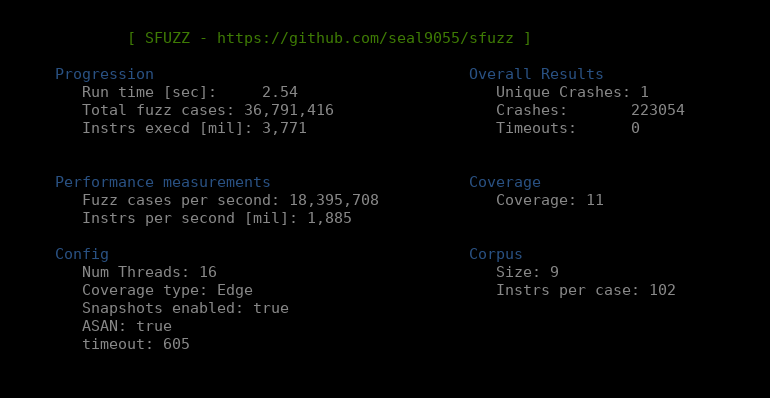

# SFUZZ
Start date: Dec, 2021

This is a coverage-guided, emulation based greybox fuzzer that makes use of a custom Just-In-Time compiler to achieve near-native performance. It works by lifting RISC-V elf binaries to an intermediate representation before JIT compiling them to x86 during execution. During JIT compilation the code is instrumented to enable fuzzing-improvements such as coverage tracking, asan, cmpcov, or snapshot-based fuzzing.

<br>

#### Features
- Multi-threaded, supporting an arbitrary amount of threads and scaling almost linearly
- Custom JIT compiler for high performance and more importantly customizability that is harder 
  to achieve with other solutions such as qemu
- Custom memory management unit to once again allow high customization and highly beneficial features
  such as byte-level permission checks and dirty-bit based emulator resets. Additionally hooks to allow for
  safe usage of heap-routines are implemented.
- Virtualized file management to allow easy in memory fuzzing
- Snapshot based fuzzing, so a target's memory/register state can be snapshotted during execution to
  base all future fuzz cases off of this baseline
- Edge-level coverage tracking, and coverage guided fuzzing based on this feedback
- Various mutators, crash deduplication, and a simple seed scheduling algorithm

<br>
<p style="text-align:center;"></p>

#### Description

The objective of this project is to highlight the benefits of using an emulated environment for
fuzzing. Many previous fuzzers based on emulation exist, but they all almost exclusively use the qemu
emulation engine for the underlying emulation. While this engine does have a fairly mature
just-in-time compiler and generates very good code, it is not designed for fuzzing. During fuzzing, 
we intend to run the same process thousands of times per second. This makes room for specialized 
optimizations that qemu does not make strong use of such as reusing the same memory space for each 
process run and only resetting a limited amount of memory via dirty bit mechanics.

In many ways, this is more of a proof-of-concept that I wanted to work on to learn about compiler internals, and have an emulation-based playground to play around with various fuzzing techniques such as different coverage metrics, seed schedulers, and snapshot-based fuzzing. With more JIT optimizations and most importantly, extensions to include more popular architectures such as mips or arm this could however certainly be used to efficiently fuzz closed source code that cannot simply be instrumented through recompilation.

Given the testing I have done so far, sfuzz has significantly less overhead than many other popular fuzzers, which results in very fast performance, especially for small fuzz cases.

More details on the features/choices made for this fuzzer are listed in the accompanying blogpost (https://seal9055.com/blog/fuzzing/sfuzz) and the documentation files listed below:
- Memory Management - [memory_management.md](https://github.com/seal9055/sfuzz/tree/main/docs/memory_management.md)
- Code Generation - [code_gen.md](https://github.com/seal9055/sfuzz/tree/main/docs/code_gen.md)
- Fuzzer implementation/features - [fuzzing.md](https://github.com/seal9055/sfuzz/tree/main/docs/fuzzing.md)
- Some simple tests - [benchmarking.md](https://github.com/seal9055/sfuzz/tree/main/docs/benchmarking.md)

#### Usage

This entire fuzzer is written in rust, so after cloning the repository, just run `cargo build --release` to compile.

Since the fuzzer currently only supports RISC-V, the target needs to be compiled to RISC-V using the below toolchain (or a similar one). Alternatively if you already have a RISC-V binary that will work perfectly fine too.

Once this is set up, just create input/output directories, add some initial seed files to the input directory and start up the fuzzer.

`./sfuzz -i in -o out -- ./test_cases/simple_test @@`

Additional flags can be passed in via commandline options to specify the number of threads, enable snapshot fuzzing, add a dictionary to the mutator, etc. The additional options can be listed by running sfuzz with the `-h` flag.

If you wish to test the fuzzer against some targets of varying complexity, the progrem_generator at `tools/program_generator` can be used to automatically generate programs of varying complexity. Note that you will require a RISC-V toolchain to then compile the target.

#### Riscv toolchain to compile binaries for the fuzzer

This sets up a toolchain to compile riscv binaries that can be loaded/used by this project.
```
Riscv compiler/tooling:
    sudo apt-get install autoconf automake autotools-dev curl python3 libmpc-dev libmpfr-dev \
    libgmp-dev gawk build-essential bison flex texinfo gperf libtool patchutils bc zlib1g-dev \
    libexpat-dev
    git clone https://github.com/riscv/riscv-gnu-toolchain && cd riscv-gnu-toolchain
    ./configure --prefix=/opt/riscv --with-arch=rv64i
    sudo make

Debugger:
    gdb-multiarch
```

#### TODO

This list represents a set of features that I plan on implementing in the future.

- [X] Working Memory management unit
- [X] JIT Compiler
- [X] Virtualized files for in-memory fuzzing
- [X] Byte level permission checks + hooked/safe allocators
- [X] Track edge level coverage
- [X] Persistent mode to fuzz in small loops around target functions
- [X] Crash deduping / unique crashes
- [X] Update mutators to include more options
- [X] Seed Scheduling
- [X] CmpCov to get past magic values and checksums
- [X] Add some tooling around the fuzzer
- [ ] Proper benchmarking
- [ ] Implement RISC-V M & A extensions, so that the JIT can use glibc instead of newlib
- [ ] Replace assembler to improve compilation speed
- [ ] Support more architectures (eg. mips, arm)
- [ ] JIT optimizations, and another attempt at register allocation

#### References

* All papers listed in [fuzzing.md](https://github.com/seal9055/sfuzz/blob/main/fuzzing.md)
* Emulation based fuzzing - Brandon Falk [GamozoLabs](https://gamozolabs.github.io/)
* Intel Software Developer Manuals
* RISCV User ISA specification
* Rv8: a high performance RISC-V to x86 binary translator - Michael Clark & Bruce Hoult
* Engineerining a compiler Keith D. Cooper & Londa Torczon
* Cranelift [https://cfallin.org/blog/] - Chris Fallin
* Generating Low-Overhead Dynamic Binary Translators - Mathias Payer & Thomas R. Gross
* Efficiently Computing Static Single Assignment Form and the Control Dependence Graph - Cytron et al
* Computing Liveness Sets for SSA-Form Programs - Brandner et al
* Linear Scan Register Allocation on SSA Form - Christian Wimmer & Michael Franz
* http://web.cs.ucla.edu/~palsberg/course/cs132/linearscan.pdf
* AddressSanitizer: A Fast Address Sanity Checker
    https://static.googleusercontent.com/media/research.google.com/en//pubs/archive/37752.pdf
