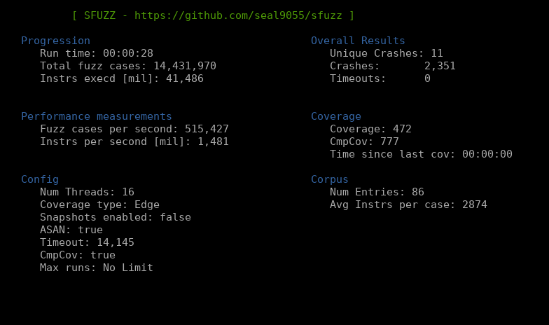

# SFUZZ
Start date: Dec, 2021

This is a performance and scaling focused blackbox fuzzer that makes use of RISC-V to x86\_64 binary translations
and a custom JIT-compilation engine. The fuzzer runs successfully against simple targets and has
been tested against both custom programs highlighting short/longer cases and a couple of binutils
binaries.
<br>

#### Features
- Multi-threaded, supporting an arbitrary amount of threads and scaling almost linearly
- Custom JIT compiler for high performance and more importantly customizability that is harder 
  to achieve with other solutions such as qemu
- Custom memory management unit to once again allow high customization and highly beneficial features
  such as byte-level permission checks and dirty-bit based emulator resets. Additionally hooks to allow for
  safe usage of heap-routines are implemented.
- Virtualized file management to allow easy in memory fuzzing
- Snapshot based fuzzing, so a target's memory/register state can be snapshotted during execution to
  base all future fuzz cases off of this baseline
- Edge-level coverage tracking, and coverage guided fuzzing based on this feedback
- Various mutators, crash deduplication, and a simple seed scheduling algorithm

<br>
<p style="text-align:center;"></p>

#### Description

The objective of this project is to highlight the benefits of using an emulated environment for
fuzzing. Many previous fuzzers based on emulation exist, but they all almost exclusively use the qemu
emulation engine for the underlying emulation. While this engine does have a fairly mature
just-in-time compiler and generates very good code, it is not designed for fuzzing. During fuzzing, 
we intend to run the same process thousands of times per second. This makes room for specialized 
optimizations that qemu does not make strong use of such as reusing the same memory space for each 
process run and only resetting a limited amount of memory via dirty bit mechanics.

This fuzzer will not replace AFL++ or any other existing fuzzers, and this is not its goal. I developed
sfuzz so I would have a simple emulated environment that I had full control over. This lets me try out 
various different fuzzing techniques and modify the fuzzer however I see fit. Given the testing I have done
so far, sfuzz has significantly less overhead than afl++ (even when comparing my emulation to afl's compile-time
instrumentation) which results in very fast performance for small fuzz cases, but lackluster performance for larger
cases since my JIT codegen is much more naive than qemu's (or no emulation at all with compile-time instrumentation).

I believe that in the future with enough work, sfuzz has the potential to properly compete with existing fuzzers given
some of its advantages (especially when it comes to scaling across multiple threads), but it will never be as easy to
use, or as generally applicable as some of the other fuzzers out there.

More details on the features/choices made for this fuzzer are listed in the files below:
- Memory Management - [memory_management.md](https://github.com/seal9055/sfuzz/tree/main/docs/memory_management.md)
- Code Generation - [code_gen.md](https://github.com/seal9055/sfuzz/tree/main/docs/code_gen.md)
- Fuzzer implementation/features - [fuzzing.md](https://github.com/seal9055/sfuzz/tree/main/docs/fuzzing.md)
- Some simple tests - [benchmarking.md](https://github.com/seal9055/sfuzz/tree/main/docs/benchmarking.md)

#### Usage

This fuzzer can simply be run using cargo. The target needs to be compiled to riscv using the below toolchain 
(or a similar one). Once this is setup, the target/arguments can be setup in `src/main.rs`, and some configuration
flags can be set in `src/config.rs` if desired. For the most part it should work out of the box though.

Note that the fuzzer currently only implements \~10 different syscalls, so if you are attempting to fuzz an application
that makes use of a syscall that is not yet implemented in this fuzzer, you will need to manually add an implementation
for the syscall to `src/syscalls.rs`. 

#### Riscv toolchain to compile binaries for the fuzzer

This sets up a toolchain to compile riscv binaries that can be loaded/used by this project.
```
Riscv compiler/tooling:
    sudo apt-get install autoconf automake autotools-dev curl python3 libmpc-dev libmpfr-dev \
    libgmp-dev gawk build-essential bison flex texinfo gperf libtool patchutils bc zlib1g-dev \
    libexpat-dev
    git clone https://github.com/riscv/riscv-gnu-toolchain && cd riscv-gnu-toolchain
    ./configure --prefix=/opt/riscv --with-arch=rv64i
    sudo make

Debugger:
    gdb-multiarch
```

#### TODO

This list represents a set of features that I plan on implementing in the future.

- [X] Working Memory management unit
- [X] JIT Compiler
- [X] Virtualized files for in-memory fuzzing
- [X] Byte level permission checks + hooked/safe allocators
- [X] Track edge level coverage
- [X] Persistent mode to fuzz in small loops around target functions
- [X] Crash deduping / unique crashes
- [X] Update mutators to include more options
- [X] Seed Scheduling
- [X] Add some tooling around the fuzzer
- [ ] Proper benchmarking
- [ ] CMP deconstruction to get past magic values and checksums
- [ ] Crash exploration mode
- [ ] Implement riscv-atomics so the JIT can use libc instead of newlib
- [ ] Replace assembler to increase compile time's
- [ ] JIT optimizations, and another attempt at register allocation

#### References

* All papers listed in [fuzzing.md](https://github.com/seal9055/sfuzz/blob/main/fuzzing.md)
* Emulation based fuzzing - Brandon Falk [GamozoLabs](https://gamozolabs.github.io/)
* Intel Software Developer Manuals
* RISCV User ISA specification
* Rv8: a high performance RISC-V to x86 binary translator - Michael Clark & Bruce Hoult
* Engineerining a compiler Keith D. Cooper & Londa Torczon
* Cranelift [https://cfallin.org/blog/] - Chris Fallin
* Generating Low-Overhead Dynamic Binary Translators - Mathias Payer & Thomas R. Gross
* Efficiently Computing Static Single Assignment Form and the Control Dependence Graph - Cytron et al
* Computing Liveness Sets for SSA-Form Programs - Brandner et al
* Linear Scan Register Allocation on SSA Form - Christian Wimmer & Michael Franz
* http://web.cs.ucla.edu/~palsberg/course/cs132/linearscan.pdf
* AddressSanitizer: A Fast Address Sanity Checker
    https://static.googleusercontent.com/media/research.google.com/en//pubs/archive/37752.pdf
