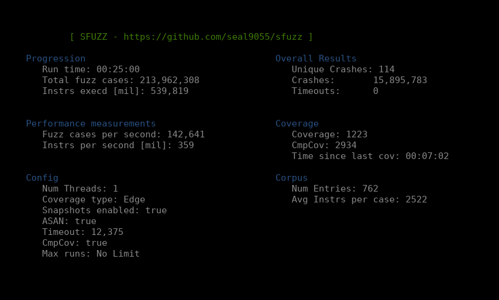
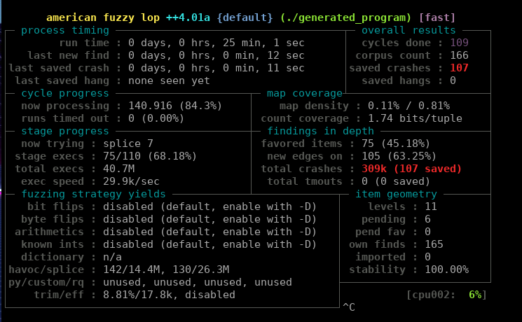

# Benchmarks & Testing

##### &nbsp;Since the fuzzer is not at a point where it can run proper benchmarks (eg. [fuzzbench](https://google.github.io/fuzzbench/)), this pretty much consists solely of sample programs I wrote and other programs I chose to include. Note that this means that my conclusions may be biased.
<br>

#### Performance against a very Simple Target

**Experiment-Setup**  
This initial test just compares the fuzzer's performance when used on a very simple test binary. This test showcases the low overhead of the fuzzer when it comes to resetting memory and running many very short cases. Arguably this is not a very important test-case since no real program will be this simple, but I found it interesting nonetheless. The program basically just has the fuzzer jump through some small if-comparison's before segfaulting, thus giving the fuzzer a crash. Any coverage guided fuzzer should be able to trivially find the crash within seconds. The corpus consists of a 100-byte file generated from `/dev/urandom`.

For this test-case, all of my fuzzer's features are enabled, including coverage tracking, byte-level permissions, allocator-hooks, in-memory fuzzing, cmpcov, and snapshot based fuzzing. I set the snapshot right after the call to `open`.

I will be comparing my fuzzer's performance to AFL++ while testing both qemu-emulation and compile-time instrumentation for AFL. Since this is a state-less target, I will also instrument the below code for AFL's persistent-mode fuzzing and in-memory input generation as described in AFL's [docs](https://github.com/AFLplusplus/AFLplusplus/blob/stable/instrumentation/README.persistent_mode.md).
```c
int main(int argc, char **argv) {
    char buf[100];
    int fd = open(argv[1], O_RDONLY);

    read(fd, buf, 100);

    if (buf[0] == 0x41) {
      if (buf[1] == 0x42) {
        if (buf[2] == 0x43) {
          if (buf[3] == 0x44) {
            if (buf[4] == 0x45) {
              if (buf[5] == 0x46) {
                *(unsigned long*)0x4141414141414141 = 0;
              }
            }
          }
        }
      }
    }
    return 0;
}
```

**Results**
| Setup | Result |
| --- | --- |
| SFUZZ - Snapshot | 1.1 million fuzz cases per second |
| SFUZZ - No-Snapshot | 650,000 fuzz cases per second |
| AFL++ - QEMU | 3,500 fuzz cases per second |
| AFL++ - Source-Instr. | 3,500 fuzz cases per second |
| AFL++ - Source-Instr. + Persistent/in-memory | 33,000 fuzz cases per second |
<br> 

SFUZZ finds the crash within the first second of running and executes about 1.1 million fuzz cases per second. Disabling snapshot based fuzzing and starting each test case at the `_start` function still finds the crash immediately, but performance drops to 650,000 per second. This massive gap is because this is a very small program for which the initialization routines make up the majority of the code, so being able to skip these is very beneficial.

I tested AFL++ in 2 modes, qemu and source code instrumented. Starting with qemu-mode and a -O3 compiled binary (without any snapshot/persistent fuzzing mechanisms enabled), AFL requires 2 and a half minutes to find the crash and runs at about 3500 fuzz cases per second. Taking the non-snapshot version of my fuzzer, this is a \~185x speedup. 

With source based instrumentation using the afl-clang-fast compiler with the flags shown below, AFL finds the crash in 3 minutes, and runs at 3500 fuzz cases per second once again. I would have expected this to run a lot faster than the qemu-based approach, but I believe that the setup should be correct. Things start to look a little different with persistent-mode/in memory fuzzing enabled. AFL++ is now able to generate 33,000 fuzz cases per second and also finds the crash in the first second.

```
AFL_USE_ASAN=1 LLVM_CONFIG=llvm-config-11 ~/AFLplusplus/afl-clang-fast ../test_cases/simple_test.c -o simple_test_afl -O3

~/AFLplusplus/afl-fuzz (-D) -i in -o out -- ./simple_test_afl @@
```

I believe that the emulated version of AFL using qemu is the fairer comparison since my fuzzer does not require source code for its instrumentation and fully emulates. I include both metrics though since my fuzzer currently only supports RISC-V which is not a very popular architecture, and will thus generally require source code as well to recompile to RISC-V.

#### More Complex Randomly Generated Program

**Experiment-Setup**  
The this case the target was automatically generated using the [program_generation](https://github.com/seal9055/sfuzz/tree/main/tools/program_generator) tool I wrote. It automatically generates a C program that takes its fuzz-input from a file and uses it to attempt to pass various `if`-checks. 

The program was generated with a complexity configuration of `9` and generated a 6200 loc target. The generated code is also saved [here](https://github.com/seal9055/sfuzz/blob/main/test_cases/generated_program.c).

Apart from that the remaining setup is the exact same as for the first case, using a 500-byte randomly generated input-seed. For the below results, both afl and SFUZZ were run for 15mins

**Results**
| Setup | Result |
| --- | --- |
| SFUZZ - Snapshot | 142,000 fuzz cases per second, 114 unique crashes |
| SFUZZ - No-Snapshot | 105,000 fuzz cases per second, 108 unique crashes |
| AFL++ - QEMU | 2,400 fuzz cases per second, 85 unique crashes |
| AFL++ - Source-Instr. | 2,600 fuzz cases per second, 78 unique crashes |
| AFL++ - Source-Instr. + Persistent/in-memory | 30,000 fuzz cases per second, 107 unique crashes |
<br> 
Once again SFUZZ outperforms AFL by a pretty good margin. The performance gap is however much
smaller in this case than in the previous one since more instructions are being executed for each
fuzz-case resulting in clang's optimizations granting large benefits when compared to my naive JIT.

Once again persistent mode adds immense performance benefits to AFL, which is reflected very heavily
in its overall results. Default source code instrumentation once again seems to perform very similar 
to qemu. I have no idea why this is the case or if I might be messing something up in my AFL setup,
but these are the results are ended up recording.

For this simple target SFUZZ with snapshotting enabled seems to have found most possible crashes by 
the 18 minute mark. After this point it did not find any more coverage.

According to the final results, AFL seems to have kept up in terms of the unique crashes it was able
to find, however, AFL++ determines a crash's uniqueness based on the path taken to reach the crash.
Since there are multiple paths to reach each of the crashes inside the target that number is a
little misleading. Nevertheless, AFL still found a decent amount of crashes when considering the
performance deficit. I believe that this is in big parts due to AFL's corpus management and seed
prioritization algorithms. The one's currently in use for SFUZZ are super simple and don't perform
any corpus minimization.

The output screens at the end of the timeframe for both AFL and SFUZZ are listed below
(snapshot/persistent mode were enabled for both SFUZZ and AFL for the below results).


<p></p>
<p></p>

